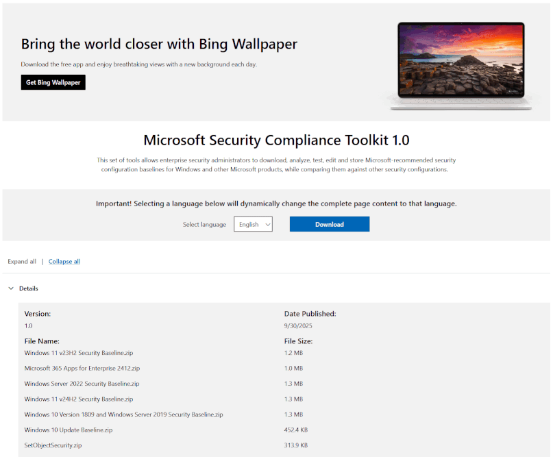

# 📗 LGPO.exe 操作手冊

## ⚙️ 環境須知

- **權限**: 必須以「系統管理員」身分執行。
- 至 [Microsoft Security Compliance Toolkit 1.0](https://www.microsoft.com/en-us/download/details.aspx?id=55319) 頁面選擇 `LGPO.zip` 下載解壓縮，並放置於腳本根目錄或加入至系統 PATH 中。

    

## 🛠 操作流程

- **CMD**: 路徑必須為「完整路徑」，且目標資料夾須預先存在。
- **PowerShell**: 支援使用「相對路徑」。

### 1. 備份原始群組原則

輸入下述指令後，將會在指定路徑產生包含本機與使用者原則之資料夾 `{GUID}`。

```powershell
LGPO /b "PATH-TO-SAVE" /n "YOUR-GPO-NAME"
```

### 2. 解析本機與使用者原則

將 `pol` 轉換為可編輯的文字檔 `txt`

```powershell
# 電腦設定
LGPO /parse /m "...\{GUID}\DomainSyscol\GPO\Machine\registry.pol" >> machine.txt

# 使用者設定
LGPO /parse /u "...\{GUID}\DomainSyscol\GPO\User\registry.pol" >> user.txt
```

### 3. 編譯成 pol

自由編輯 `txt` 後，轉為 `pol` 格式。

```powershell
LGPO /r "...\File-Name.txt" /w "...\File-Name.pol"
```

### 4. 匯入系統

將編譯好的 `pol` 套用至系統。

```powershell
# 電腦設定
LGPO /m "...\File-Name.pol"

# 使用者設定
LGPO /u "...\File-Name.pol"
```

### 5. 套用變更

變更群組管理原則後須套用變更。

```powershell
gpupdate /force
```

## 原文說明

```text
LGPO.exe - Local Group Policy Object Utility
Version 3.0.2004.13001
Copyright (C) 2015-2020 Microsoft Corporation
Security Compliance Toolkit - https://www.microsoft.com/download/details.aspx?id=55319

LGPO.exe has four modes:
  * Import and apply policy settings;
  * Export local policy to a GPO backup;
  * Parse a registry.pol file to "LGPO text" format;
  * Build a registry.pol file from "LGPO text".

To apply policy settings:

    LGPO.exe command [...]

    where "command" is one or more of the following (each of which can be repeated):

    /g path                   import settings from one or more GPO backups under "path"
    /p path\lgpo.PolicyRules  import settings from a Policy Analyzer .PolicyRules file
    /m path\registry.pol      import settings from registry.pol into machine config
    /u path\registry.pol      import settings from registry.pol into user config
    /ua path\registry.pol     import settings from registry.pol into user config for Administrators
    /un path\registry.pol     import settings from registry.pol into user config for Non-Administrators
    /u:username path\registry.pol
                              import settings from registry.pol into user config for local user
                              specified by "username"
    /s path\GptTmpl.inf       apply security template
    /a[c] path\Audit.csv      apply advanced auditing settings; /ac to clear policy first
    /t path\lgpo.txt          apply registry commands from LGPO text
    /e <name>|<guid>          enable GP extension for local policy processing; specify a
                              GUID, or one of these names:
                              * "zone" for IE zone mapping extension
                              * "mitigation" for mitigation options, including font blocking
                              * "audit" for advanced audit policy configuration
                              * "LAPS" for Local Administrator Password Solution
                              * "DGVBS" for Device Guard virtualization-based security
                              * "DGCI" for Device Guard code integrity policy
    /ef path\backup.xml       enable GP extensions referenced in backup.xml from a GPO backup
    /boot                     reboot after applying policies
    /v                        verbose output
    /q                        quiet output (no headers)

To create a GPO backup from local policy:

    LGPO.exe /b path [/n GPO-name]

    /b path               Create GPO backup in "path"
    /n GPO-name           Optional GPO display name (use quotes if it contains spaces)

To parse a Registry.pol file to LGPO text (stdout):

    LGPO.exe /parse [/q] {/m|/u|/ua|/un|/u:username} path\registry.pol

    /m path\registry.pol   parse registry.pol as machine config commands
    /u path\registry.pol   parse registry.pol as user config commands
    /ua path\registry.pol  parse registry.pol as user config for Administrators
    /un path\registry.pol  parse registry.pol as user config for Non-Administrators
    /u:username path\registry.pol
                           parse registry.pol as user config for local user
                           specified by "username"
    /q                     quiet output (no headers)

To build a Registry.pol file from LGPO text:

    LGPO.exe /r path\lgpo.txt /w path\registry.pol [/v]

    /r path\lgpo.txt      Read input from LGPO text file
    /w path\registry.pol  Write new registry.pol file

(See the documentation for more information and examples.)
```
