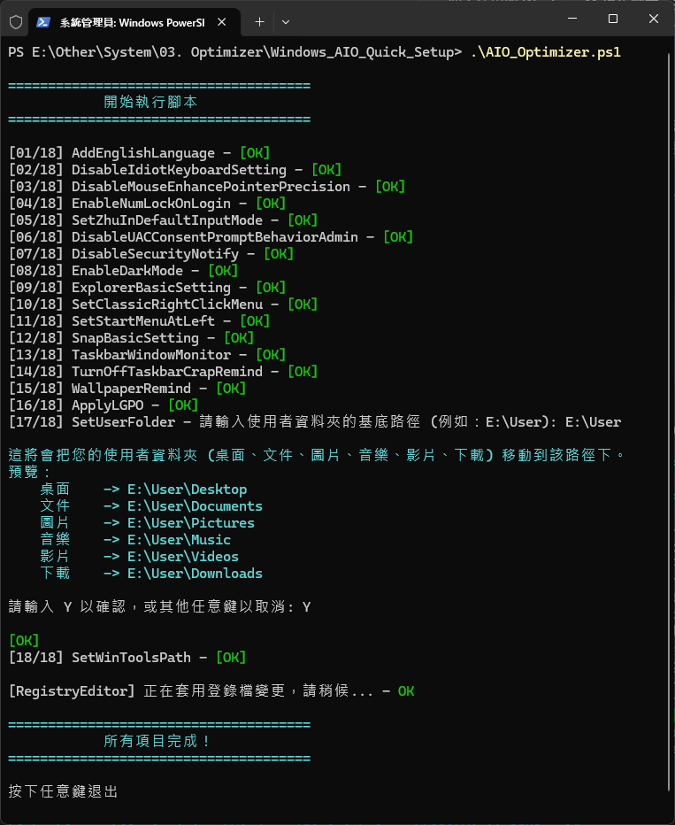

# ZiLin 的超懶人系統自動優化腳本 (ﾟ ∀。)

個人使用的 Windows 11 優化腳本，搭配 [CrapFixer](https://github.com/builtbybel/CrapFixer) 服用可達最佳效果。
不保障系統更新後可能產生的問題，使用前請自行風險評估。

## 使用方式

1. 參照 [LGPO - README.md](./LGPO/) 方法下載並將 LGPO 置入腳本根目錄。
2. 使用下列 `powershell` 指令執行腳本:

    ```powershell
    Set-ExecutionPolicy Unrestricted # 設定可執行非近端建立的腳本

    ./AIO_Optimizer.ps1              # 執行腳本

    Set-ExecutionPolicy Default      # 還原執行原則等級
    ```

## 預覽圖


